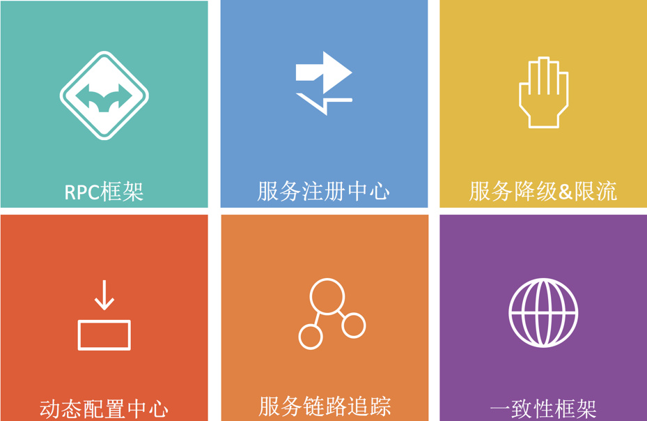

# 产品概述
服务治理平台是用友云平台开发的用于支撑微服务架构应用全生命周期管理的平台，为开发者提供从开发到运行台的一系列服务和开发套件，包含RPC框架、动态配置中心、服务注册和发现、服务链路追踪以及服务降级等服务和框架。

兼容spring以及springboot框架，为开发者实现微服务应用架构提供完整的底层支持，帮助开发者实现系统的服务化拆分和可扩展的架构。

### 你的企业是不是遇到：
- 系统耦合度高，新需求上线周期长
- 系统结构划分不合理，难以横向扩展，业务系统容量上不去
- 系统之间服务调用关系难以管理，问题难以排查
#### 这些服务治理平台统统帮你搞定，让你的系统一步加速
# 特性
- spring框架无缝集成，简洁的开发框架接入
- 支持json、protobuf、hessian等多种RPC协议
- 平台组件全部基于集群方式部署，消除单点故障
- 底层全组件的容灾支持，单一组件故障不会影响全局服务
- 支持QPS和线程并发的限流类型，并支持自定义埋点限流
- 支持细粒度的权限控制，完美实现云服务调用的权限控制

