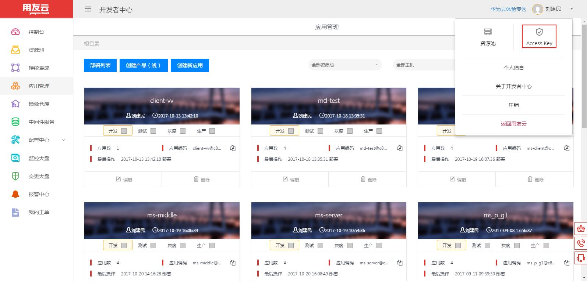
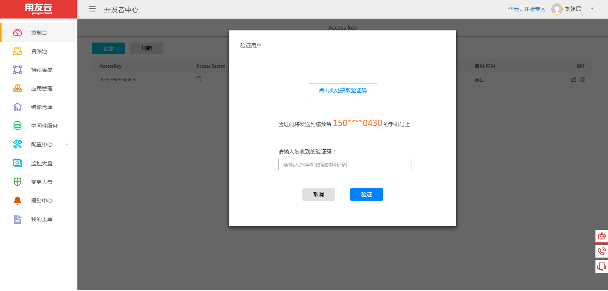

# 用户注册登录，Accsee Key创建

描述：

## 步骤一

**1：登录用友云开发者中心 https://developer.yonyoucloud.com**

**2：没有账户请先行注册，然后登录**

## 步骤二

**1：点击右上角个人用户的Access Key**

**2：点击“创建”按钮，输入手机验证码进行验证**

**3：验证成功，创建Access Key**

# 常见问题

## 常见问题1：收不到验证码

- 验证的手机号为注册时的手机号码

