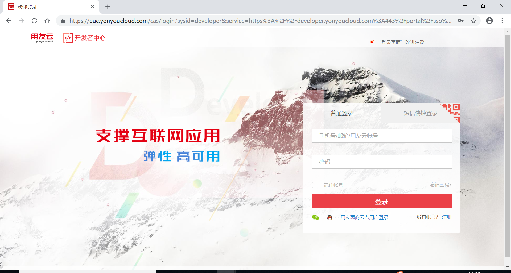

# 账号注册与登录

  在浏览器中输入地址，打开云开发者中心；点击注册按钮，可以注册开发者中心新用户。网址为：[https://developer.yonyoucloud.com](https://developer.yonyoucloud.com)。

填入手机号、验证码、密码等，信息，注册新账号。

使用新账号进行登录后，点击入驻申请按钮，进入申请界面：

在入驻界面中输入申请信息,点击提交按钮确认提交。

提示成功后回到开发者中心,刷新界面,可以看到审核状态。

待开发者中心的管理员审核通过后，用户即可进行创建资源池、创建应用等后续操作，开发者中心的具体操作，请查看相应的用户手册。

