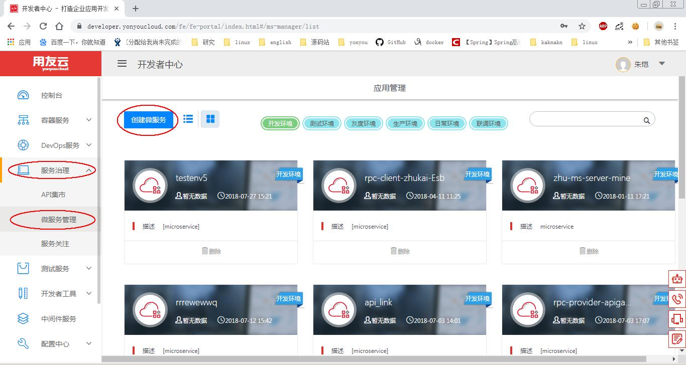
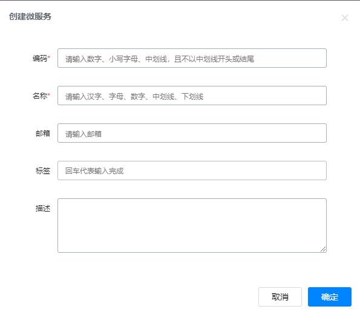
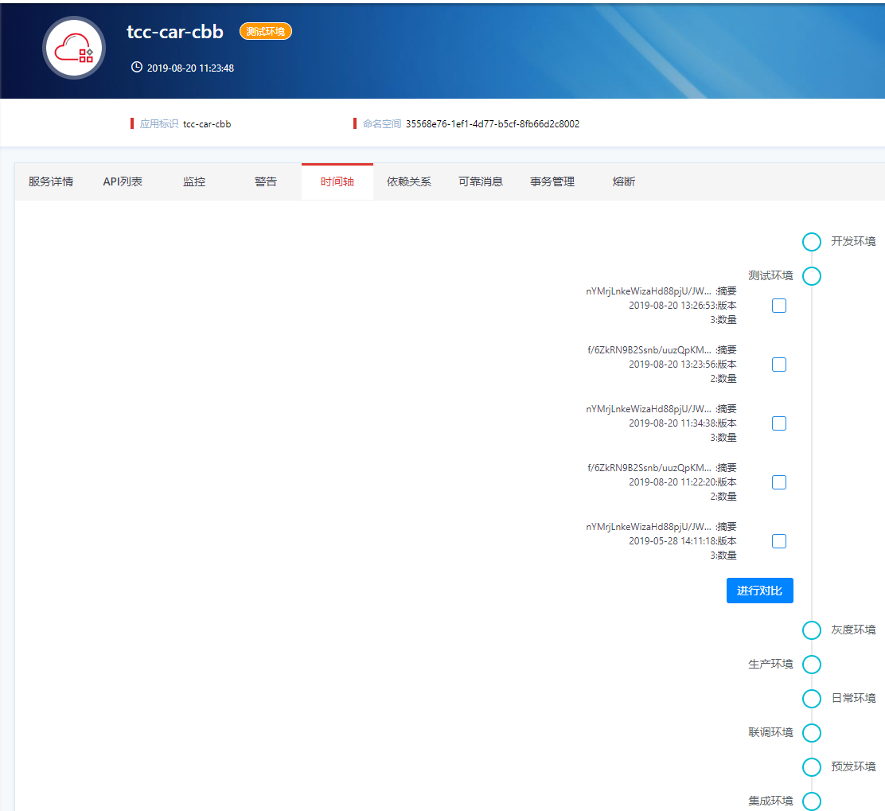
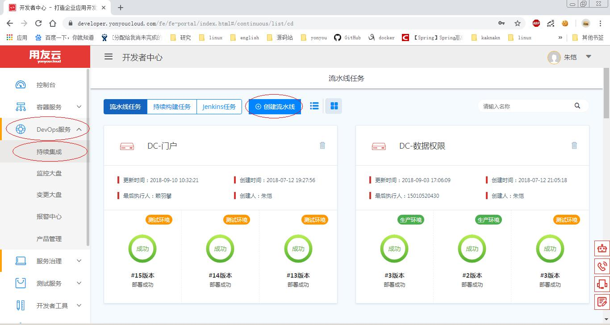
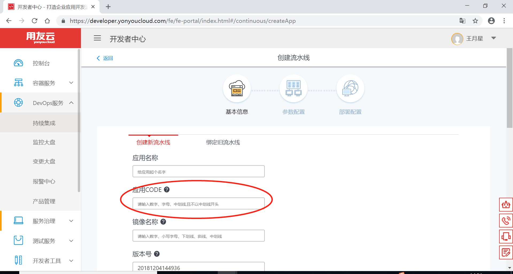
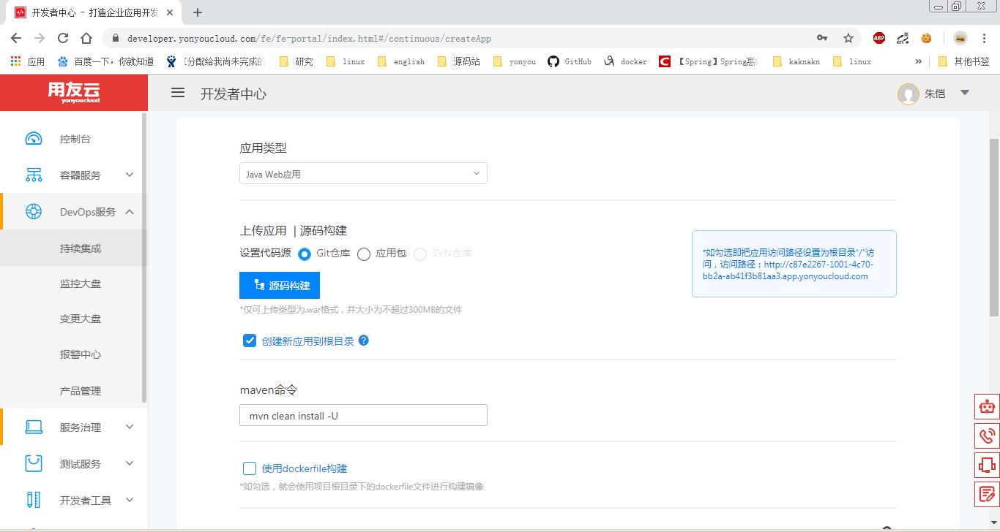
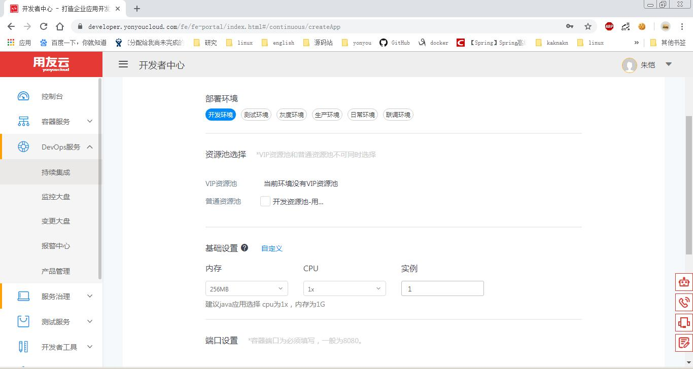
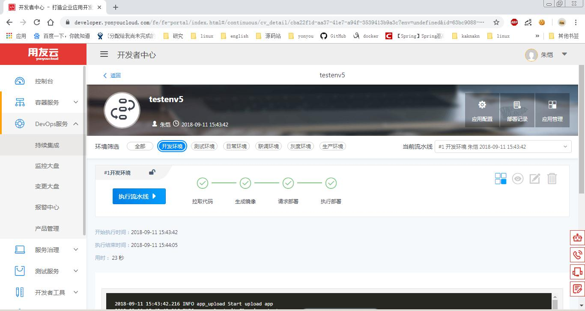
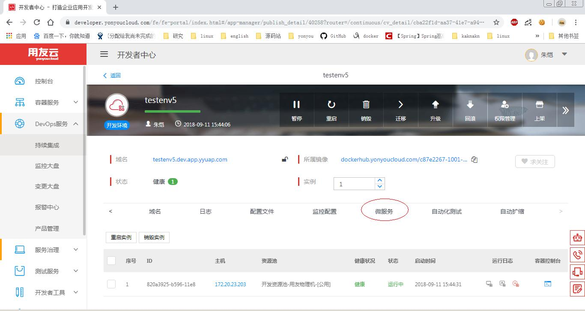
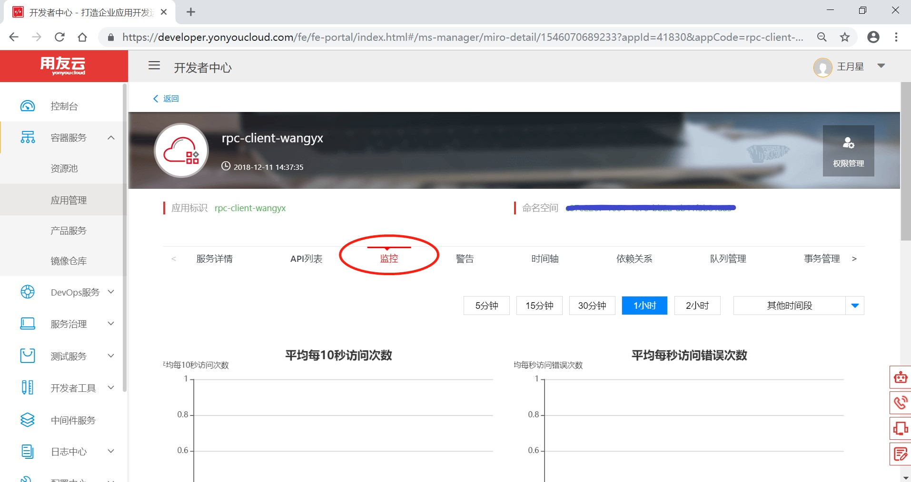

# 微服务应用创建

微服应用在开发过程中可以先创建微服务应用对微服务进行管理操作，开发完成以后可以通过开发者中心提供的持续集成功能对应用进行自动构建和发布，减轻开发者的工作量。

## 创建微服务

**1：左侧边栏选择服务治理菜单下的微服务管理，点击页面中的创建微服务按钮；**

**2：根据提示填写微服务应用名称(必须唯一且不能为中文)和描述，点击创建；**

特别说明，此处填写的邮箱为用友邮箱，其功能为，当该服务下API变化（如下图提示，图为微服务下时间轴的监控图，两相邻版本之间摘要发生变化）之后，该邮箱能够接收到API变化的邮件通知，并且该服务的上游服务也能接收到API变化的邮件通知。

**3：微服务创建会自动建立全部环境的微服务；**

**4：成功的创建微服务以后，你可以运行本地的微服务应用测试一下；**
修改application.properties的配置项，加入

- access.key
- access.secret
- spring.application.name
- spring.profiles.active

其中spring.application.name项要与创建微服务的名字一致

比如我这里建立的微服务名字为client那么spring.application.name=client
启动以后可以通过微服务标签查看微服务的各种状态，例如查看启动实例：

## 在开发者中心部署微服务
如果想要在开发者中心的资源池运行微服务就要进行微服务部署，这里我们介绍一下流水线方式部署微服务的方法。

**本部分详细操作请参考开发者中心文档，流水线创建部分**

**1：左侧边栏选择DevOps服务菜单下的持续集成，点击页面中的创建流水线按钮；**

**2：按提示填入所需信息，注意：应用CODE这部分填入微服务应用创建的对应名称，应用名推荐与微服务名称一样；**

**3：第一次使用时产品线和产品是没有的需要点击一下红圈中的维护产品线按钮创建新的产品线和产品；**

**4：填入相关信息后点击下一步，这一步需要用户填入应用类型、编码类型、基础镜像等请按需选择；**

**5：填入相关信息后点击下一步，进入部署信息配置按照实际需求填入、部署环境、资源池、基础设置等；**

**6：填入相关信息后点击创建应用，流水线就创建完毕了；**

**7：点击流水线界面的红圈处按钮可以进入应用管理页面；**

**8：应用管理页面处选择微服务标签，就可以查看微服务相关信息了；**

**9：比如这里，查看一下部署实例，这个实例是通过流水线部署在线上资源池里的；**

这个页面也可以从服务治理->微服务管理页面进入
