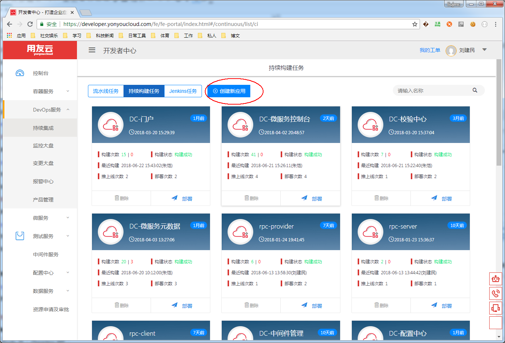

# 微服务应用创建

微服务功成开发完成之后，可以在开发者中心部署，使用容器的方式进行启动运行，开发者中心提供持续集成和容器应用管理的功能，帮助开发者进行应用的构建和发布。

## 创建应用

**1：左侧边栏选择DevOps服务菜单下的持续集成，点击持续构建页签中的创建应用按钮；**

**2：根据提示填写应用名称，应用编码，版本号，应用Logo及应用描述等信息；**

**3: 点击下一步，若已经开发完成，选择java web类型的应用，点击上传可以上传的应用的war包；**

注意：若希望在访问时保留应用的war包名称为context，请取消“是否是根目录”选项，选择符合自身情况的基础镜像进行创建。

**4: 若希望在开发微服务工程前创建应用，更改类型为SpringCloud微服务，直接点击“创建”按钮，等待应用创建成功；**

## 应用包上传(未部署)

**1：进入持续集成，找到刚刚创建成功的应用，点击右上角“上传应用包"按钮;**

**2：选择对应的war包，点击上传，等待应用构建完成；**

## 构建新版本(已部署)

**1：进入持续集成，进入指定的应用卡片，点击“构建新版本”按钮；**

**2：选择对应应用的新war包，点击上传构建新的镜像；**

## 常见问题

**应用名称重复**

- 所输入的名称与已有的应用名重复，同一个租户下不允许有重复名称的应用；
