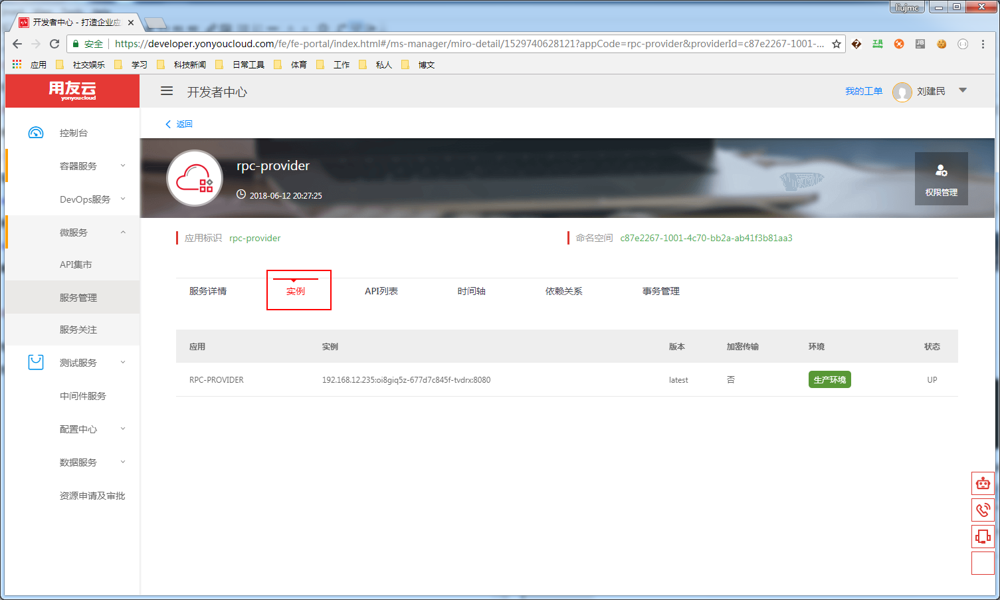

## 微服务应用部署

微服务应用开发完成之后，可以构建成war包，在DevOps服务下的持续集成上传war包或者构建新版本后，可以进行应用的部署。

## 部署应用 ##

**1：选择想要构建的版本，点击右上角部署按钮；**

**2：选择正确的产品向、产品，配置需要发布的环境，根据资源情况，选择合适的资源池，点击部署，等待完成；**

**3：部署成功后可以在容器服务的应用管理下搜索到对应的应用实例；**

**4：应用启动成功后，可以在微服务菜单下的服务管理下搜索到对应的服务；**

## 注意事项 ##

**资源池资源不足**

- 注意资源池的选择，确保部署前资源池资源充足；