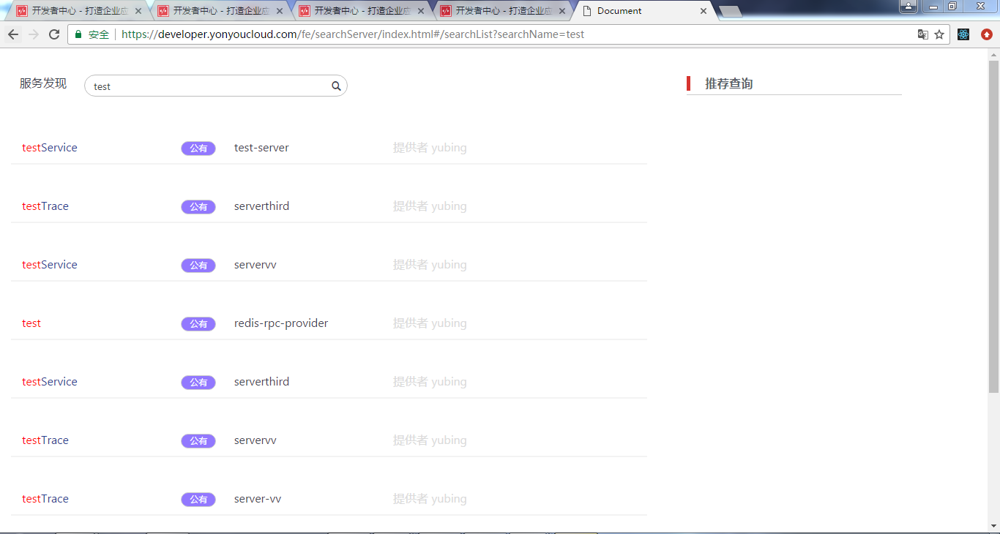
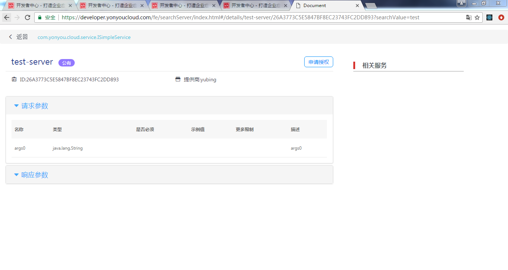

# 跨租户的服务搜索

描述：
服务搜索模块可以对注册到用友云微服务注册中心的服务进行检索，支持对服务进行关键字和名称的模糊搜索，以及搜索结果进行具体详情的展示，包含服务的提供商，服务的请求参数，响应参数等。

## 步骤

**1：搜索服务首页**

支持微服务下所有微服务的检索，如图

1.支持模糊查询和精确查询

2.搜索框提供了可以一键清空搜索内容的功能

3.支持图标点击搜索和回车事件搜索

**2：搜索列表页展示**

1.展示搜索出来的内容，包含服务的名称，公有私有权限显示，提供者等信息,如图

2.高亮红色显示服务名称和关键字匹配的内容

3.搜索框的基础功能和搜索首页的一样,新增了一个功能:当搜索框内容为空的时候，点击搜索会返回到搜索首页

4.会提供一些推荐查询（后续添加）  

**3：具体某个服务的详情页**

1.展示具体服务的详情,包含服务名称，公有私有权限显示，提供者，请求参数，响应参数等信息，如图

2.申请授权功能，暂时支持弹出显示，提示联系管理员（后续会提供接口支持）

# 常见问题

## 常见问题1：
1.在搜索框搜索的内容不存在，会进行没有数据的提示

2.在服务详情页，某个请求参数或者响应参数，里面每行的数据下面还有数据，采用表中表进行展示

