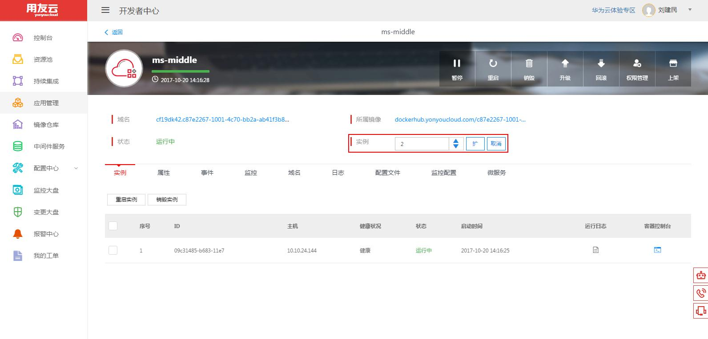

# 应用打包部署，扩容缩容

描述：
## 应用打包

**使用maven clean package将开发好的ms-client和ms-server打成war包，待部署**

## 构建新版本

**1：进入持续集成，选择创建的应用**

**2：点击“构建新版本”，上传对应的war包，等待提示构建新版本成功**

## 部署

**1：选择想要构建的版本，点击右上角部署**

**2：根据资源情况，选择合适的配置，点击部署，等待完成**

## 查看服务注册状态

**用浏览器打开URL为 https://registry.yonyoucloud.com/ 的窗口，查看服务注册情况**

## 扩容与缩容
**1：进入应用管理，选择创建的应用，点击相应的开发环境**

**2：修改“实例数”，进行扩容，缩容操作**

# 常见问题

## 常见问题1：应用部署失败

资源池不足
