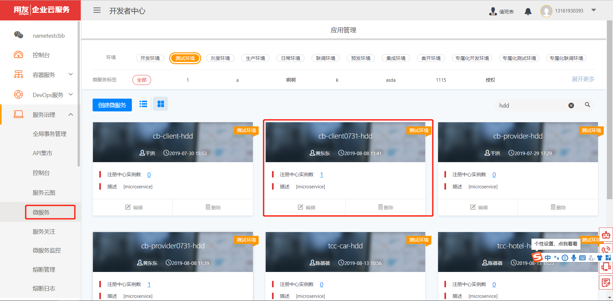
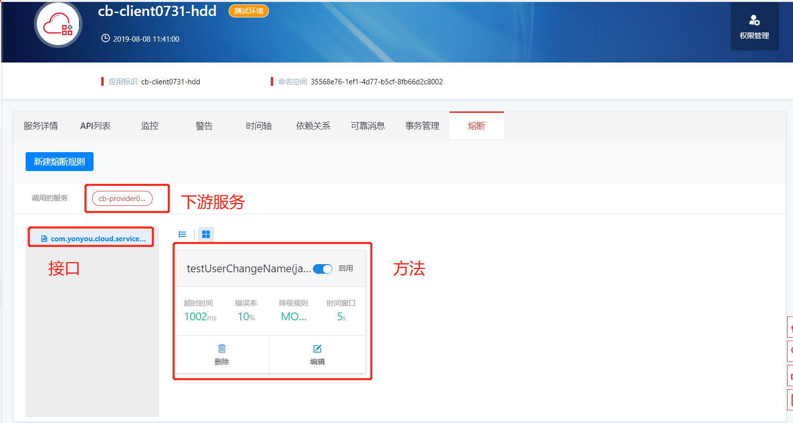
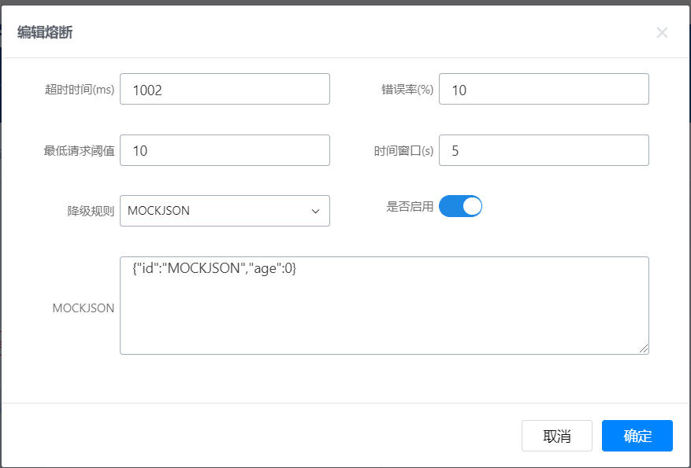
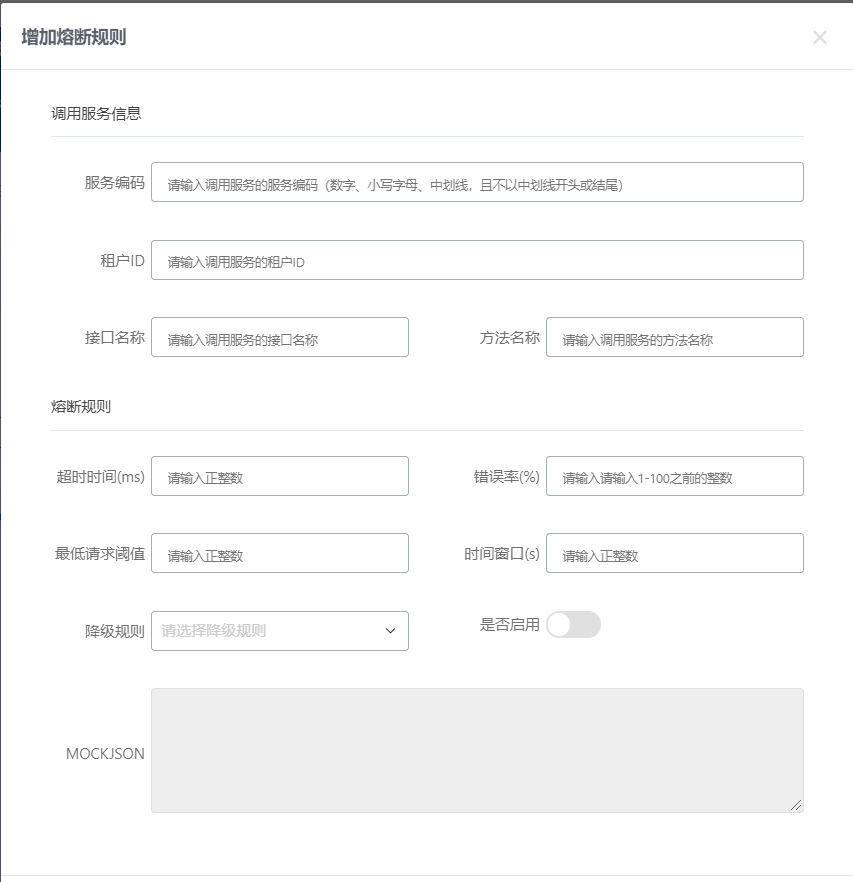
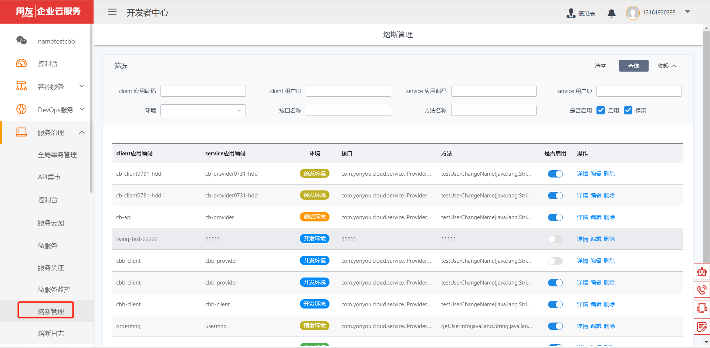
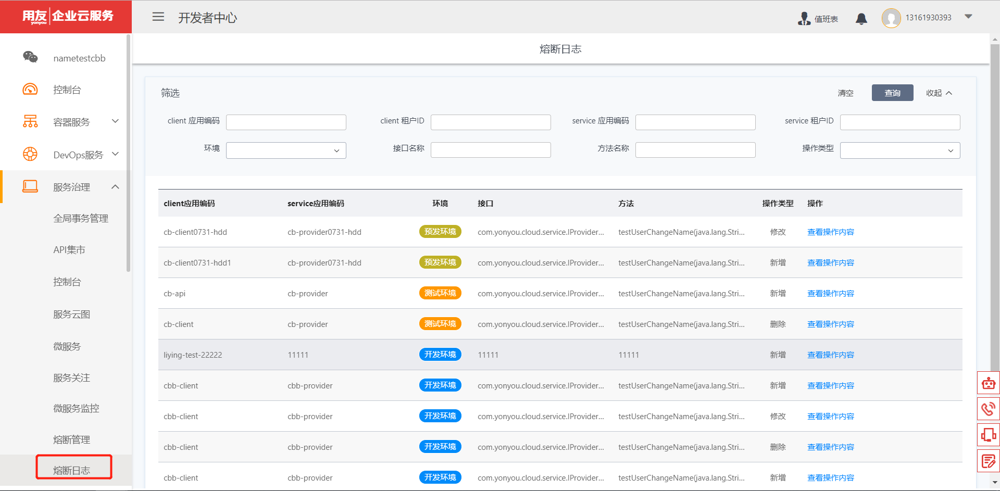
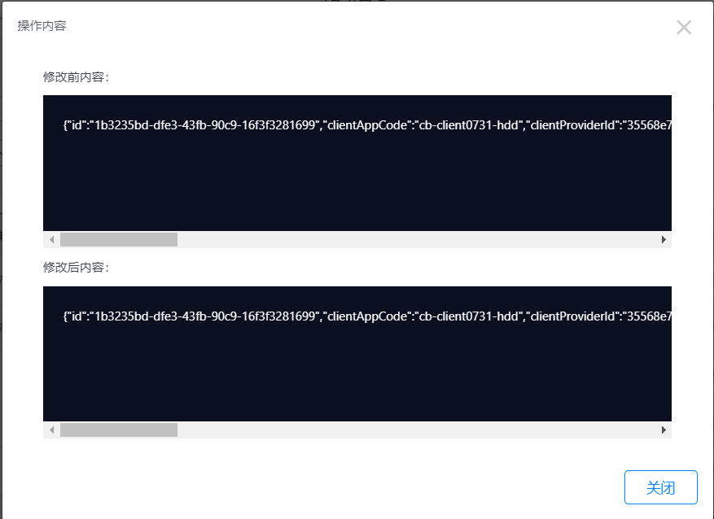

# 熔断

服务治理平台提供熔断配置功能，服务管理员在控制台以可视化方式配置服务的熔断规则，可控制熔断规则是否开启，以及对熔断规则配置日志进行查询。通过熔断对下游服务进行保护，防止异常蔓延，保证分布式系统的稳定性。

## 熔断配置

以调用端服务为视角，对该服务不同的下游服务下不同接口的不同方法设置不同的熔断规则。

熔断规则包括：超时时间（ms）、错误率（%）、最低请求阈值、时间窗口（s）、降级规则（FASTFAIL、MOCKJSON、FALLBACKCLASS）、是否启动、MOCKJSON。

下游服务、接口、方法根据RemoteCall注解扫描和链路数据自动加载，如果服务信息补全，可手动增加配置：

除了熔断规则，还需要维护下游服务编码、租户ID、接口名称、方法名称等调用服务信息。

## 熔断管理

熔断管理以全局视角对熔断配置信息进行查询、启停、规则编辑等。

## 熔断日志

通过熔断日志可对熔断规则配置的操作记录进行追溯。包括日志的查询与查看。

