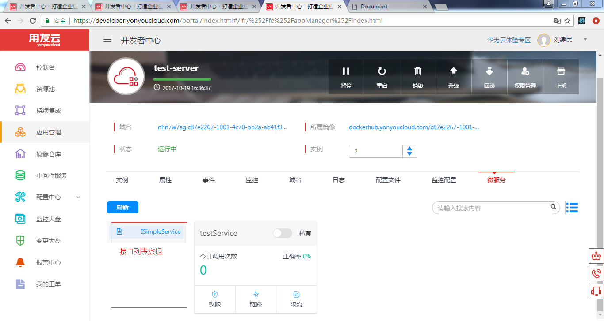
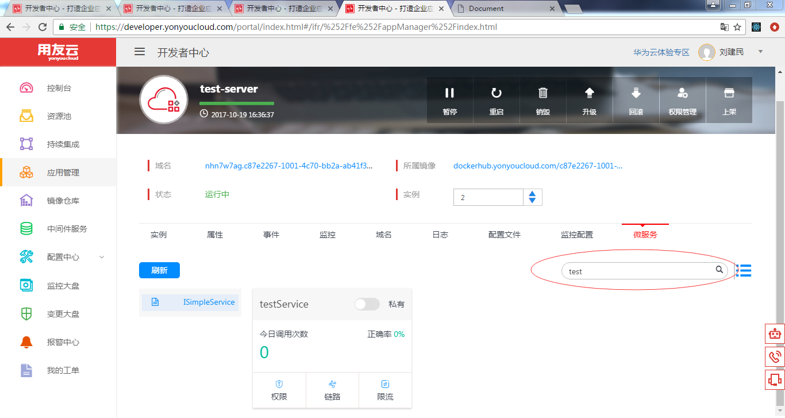
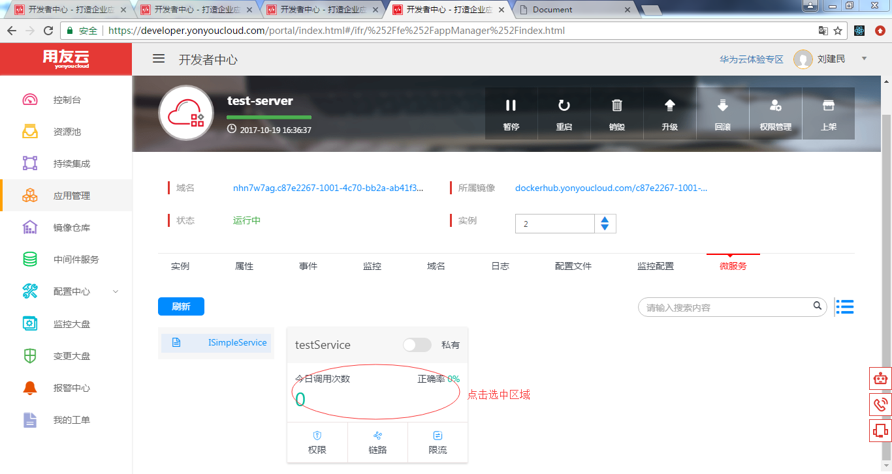
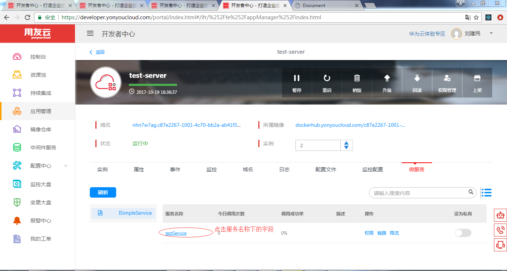
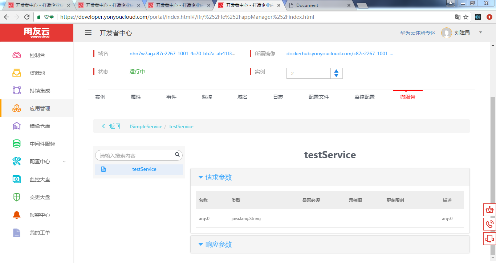

# 微服务页签的服务搜索

描述：
只能对当前应用下的服务进行搜索

## 步骤

**1：点击微服务的页签进入微服务应用**
点击微服务的页签进入微服务应用，如图

1.第一次进入的时候，会先获取左侧的接口列表数据，如图
参数列表：

        getInterface(appCode, envType) {    
            let { interface_name } = this.state;
            let params = {
            appCode: appCode,
            envType: envType
        }



2.默认是拿接口列表的第一条数据，进行当前应用及接口下的服务请求,传入的参数，分页数据size,index，接口名称serverName，应用名称appCode,环境envType
```
let { activePage, data_interface_list, addActive } = this.state;
        let { envType } = this.props;
            let params = {
            size: '10',
            index: activePage,
            appCode: appCode,
            serverName: interface_name,
            envType: envType
          }
```


**2：点击左侧接口列表**

1.点击左侧接口列表任意一个接口，都会进行当前接口下，服务的请求


2.传入的参数:
参数列表：
interface_name:表示当前点击的接口名称
```
let params = {
      searchValue: searchValue,
      size: '10',
      index: activePage,
      appCode: appCode,
      serverName: interface_name,
      envType: envType
    }
```    
**3：点击搜索框进行搜索**

1.支持回车和图标点击搜索,展示搜索后的内容,如图


2.传入的参数:和点击左侧接口操作相比，少了个接口字段serverName的参数的传入
```
let params = {
      searchValue: searchValue,
      size: '10',
      index: activePage,
      appCode: appCode,
      envType: envType
    }
```   

**4：刷新按钮操作**

1.点击刷新，按照上一次的数据结果，从新获取数据，并展示

**5：视图按钮操作**

1.点击视图,进行卡片和table的切换，数据不变，仅仅只展示效果的变换.如图


**6：点击卡片或者table的名称**

1.点击卡片或者table的名称，去往当前服务的详情页，进行数据展示




# 常见问题

## 常见问题1：
1.在搜索框搜索的内容不存在，会进行没有数据的提示

2.在服务详情页，某个请求参数或者响应参数，里面每行的数据下面还有数据，采用表中表进行展示


