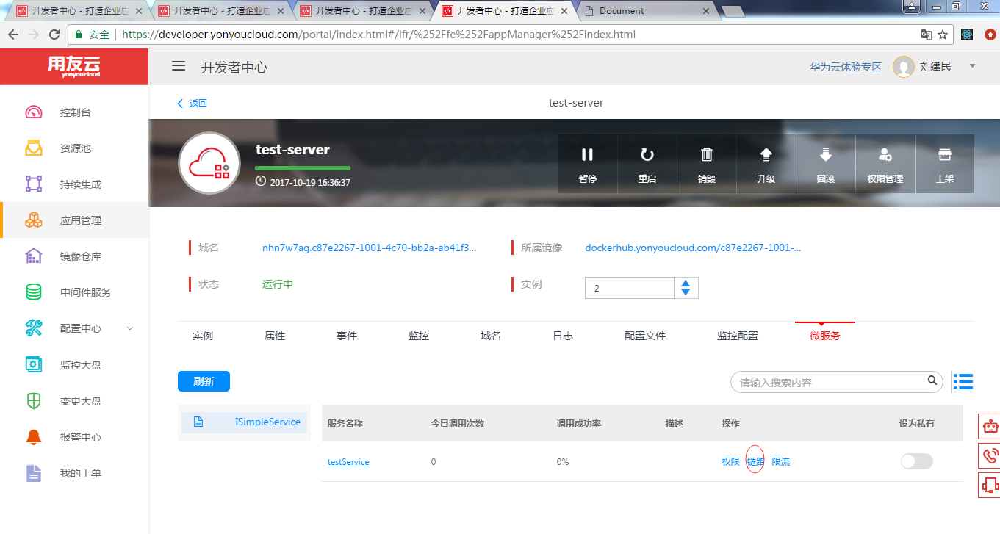
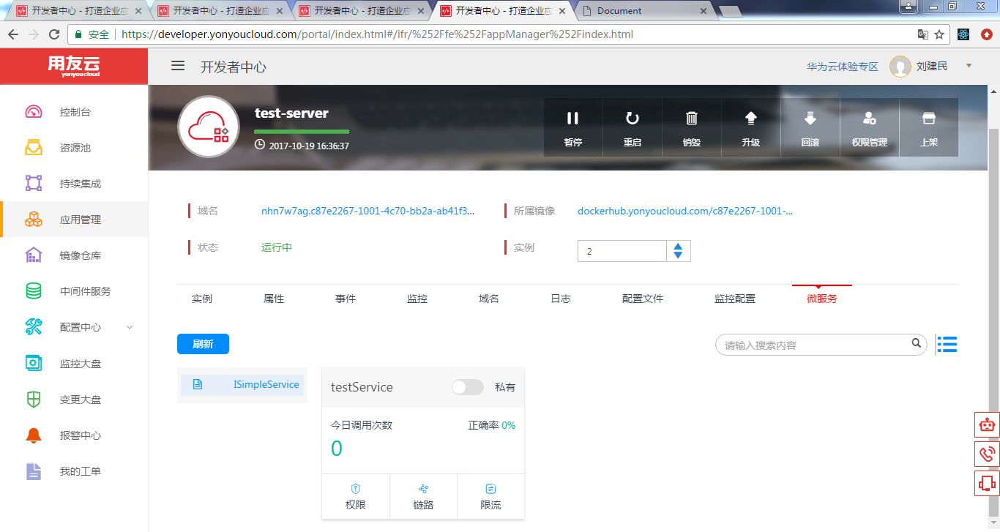
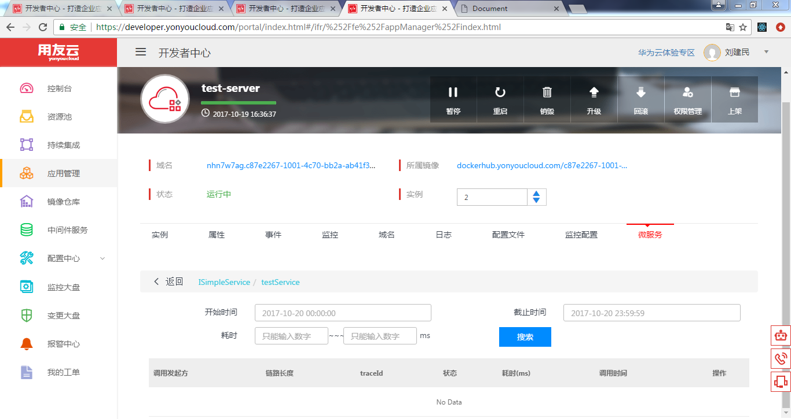
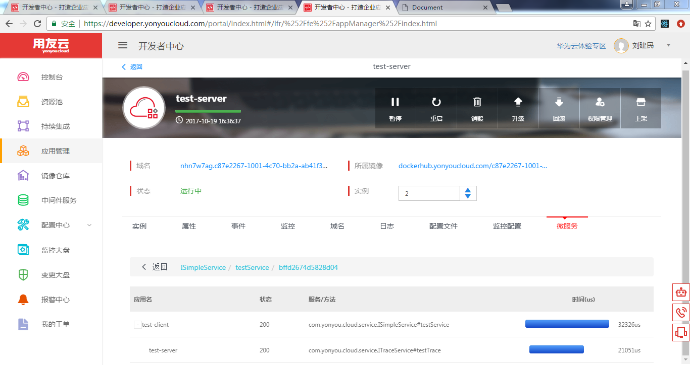

# 服务链路追踪

描述：分布式链路追踪功能提供在微服务架构下快速定位问题的能力。能够完整重现一次事务的完整调用链路，在各个节点消耗的时间，以及各个节点的状态等信息。

## 步骤一

**1：点击服务卡片或者table里面链路的操作**

点击服务卡片或者table里面链路的操作,链路的长度和今日调用次数对应
如图:
    

**2：展示链路列表数据**

1.当跳转到链路列表界面的时候，默认展示当天00点---24点的数据,如图

包含有调用发起方，链路长度，状态，调用时间等信息

2.提供了日期控件，用户可以根据日期控件进行精确选择

3.也提供了耗时区间来进行精确查找

4.当用户选择完毕后，需要进行搜索进行精确查找

**2：点击链路里的查看操作**

1.跳转到链路下钻界面，然后当前链路的一个详细数据,如图

包含有应用名称,状态，服务方法，时间维度等

2.采用树表结构进行展示，可以进行+，-号进行数据的展开与合并

3.显示的时间也根据tree表结构进行层级的递进，hover的时候，有不同颜色显示的时间描述（接口后续实现）

# 常见问题

## 常见问题1：
1.如果链路列表接口显示失败的话，这里只展示根节点

2.如果没有数据，会展示no data
