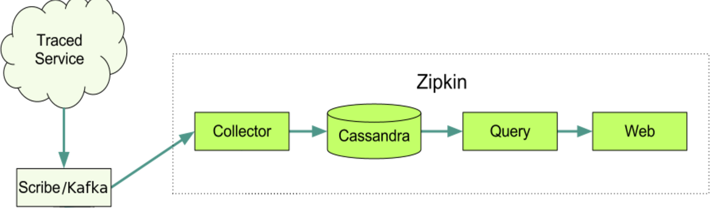
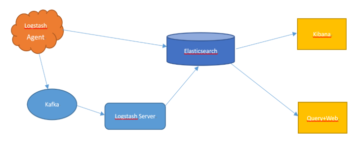

## 监控

通过对客户端和服务端引入微服务组件包，将收集到的监控数据异步发送到消息收集器，消息收集器再将监控数据存储到Elasticsearch,完成监控数据的采集。通过定时汇总监控数据，对服务提供者各个接口的依赖关系进行计算，将计算结果传入前端展示。

通过zipkin进行监控 ，如图

结构、大概流程为：

- Trace数据的收集至Kafka(Apache分布式消息系统)。
- Kafaka中的数据由控制器存入数据库中。
- 最后由UI和Query查询展示。

日志收集，计算每日调用次数，监控运行状态，简图如下

## 主要特征
- 每日调用次数
- 调用正确率
