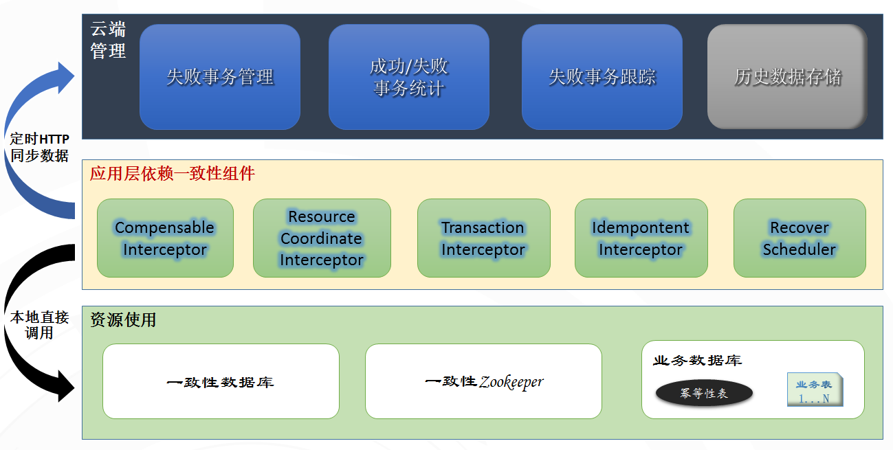

# 用友云数据一致性(apollo)

## 功能简介

用友云数据一致性组件(apollo)是一种分布式事务解决方案, 通过补偿拦截器处理事务一致性的核心流程运转, 资源协调拦截器用以协调大事务的各个参与方, 事务拦截器保证本机事务的正常提交和回滚、幂等性拦截器保证事务不被重复调用，定时恢复机制保证了异常的事务的重试机制。事务监控页面可以监控异常事务及对异常事务进行调用链路的追踪, 判断是哪个环节异常;  以下是组件架构图:

## 主要特征

- 基于三阶段提交的事务.

- 解决海量数据、高并发场景下应用按照业务纵向拆分后数据最终一致性的问题。

- 如果说单数据源应用的两阶段提交是在数据库层面的话，那么用友云数据一致性就是在应用层面的两阶段提交。

- 提供账号下失败事务的管理，调用失败服务定位及调用过程跟踪。

- 在框架层面保证业务方法的幂等性，让开发者更多的关注核心业务实现。

- 提供幂等性调用组件支持.

## 接入步骤

参见 git@git.yonyou.com:mwclient/demo.git 中的apollo-samples示例工程.

