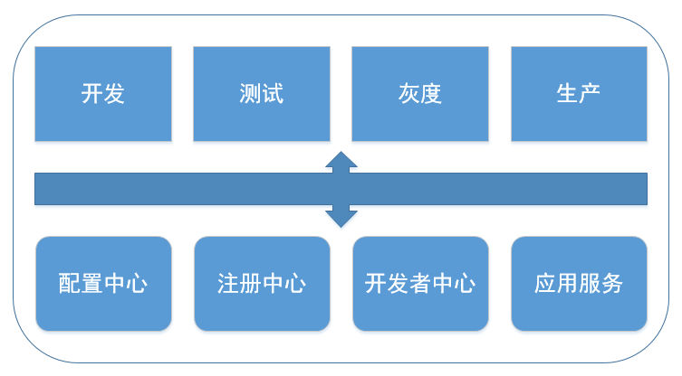

# 多套环境

## 功能简介

用友云多套环境的支持实现了应用可以在用友云同时部署多套环境的能力, 当前支持开发、测试、灰度、生产四套环境, 如下所示:

## 主要特征

- 配置中心多套环境支持: 支持多套环境的近实时推送.

- 注册中心: 支持配置文件更改部署多套环境.

- 开发者中心: 支持控制台部署时选择指定环境部署.

- 应用服务: 根据不同组件配置不同环境的配置文件进行部署.

