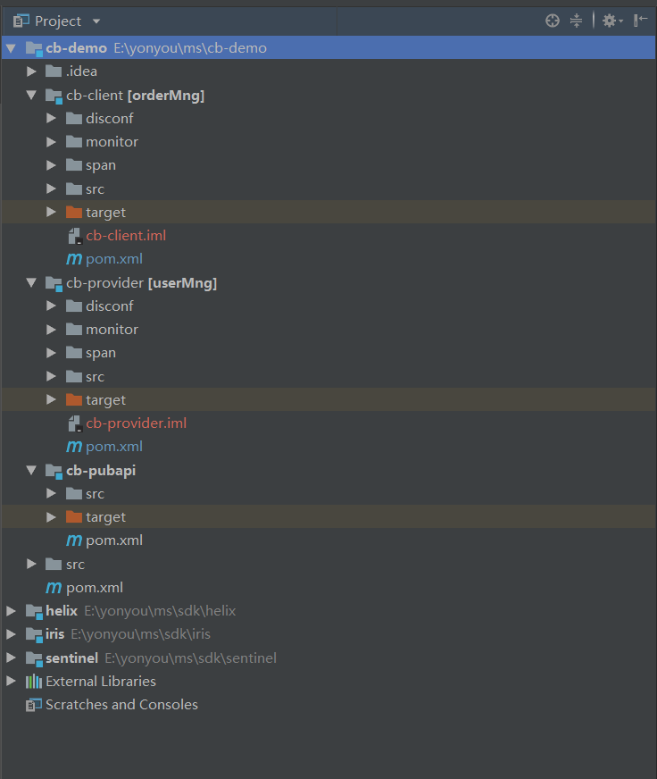
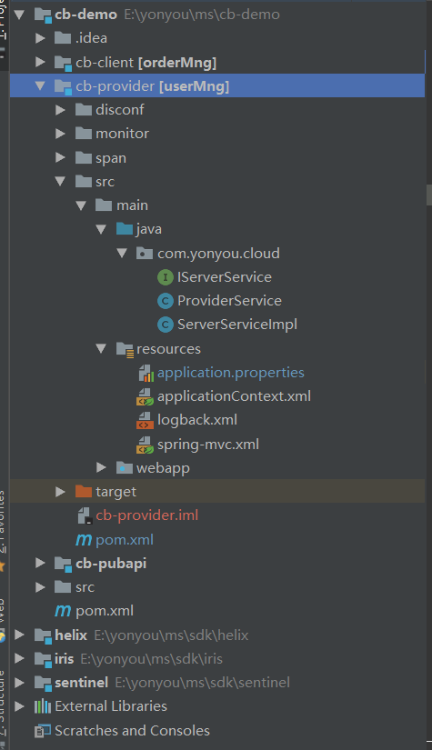

# 示例介绍

微服务治理平台提供针对5.2.1-RELEASE的官方完整熔断示例工程，工程采用Maven构建，包含父工程（cb-demo）、公用API工程（cb-pubapi）、服务调用方工程（cb-client）、服务提供方工程（cb-provider）。

业务开发者可以将示例以已有Maven工程的方式导入到IDE中进行运行调试，导入到IDE中后，效果如下：

## cb-demo

cb-demo为几个示例工程的父工程，为pom类型，工程中规范了各个子工程引用的组件的版本，定义了各个maven插件的使用方式，以及部署仓库地址。

其中，使用的微服务治理平台SDK版本和IUAP开发平台组件的版本定义如下：

	<!-- 微服务治理平台SDK -->
	<mw.version>5.2.1-RELEASE</mw.version>
	<!-- IUAP开发平台版本 -->
	<iuap.modules.version>3.2.1-RELEASE</iuap.modules.version>
	<!-- 请求加签SDK版本 -->
	<auth-sdk-client.version>1.0.15-SNAPSHOT</auth-sdk-client.version>

工程包含三个maven子工程，模块列表如下：

    <modules>
        <module>cb-pubapi</module>
        <module>cb-client</module>
        <module>cb-provider</module>
    </modules>

用户可以使用cb-demo工程对几个示例工程进行统一的编译和打包。

## cb-pubapi

cb-pubapi工程为其它三个工程的公共依赖，工程内定义了RPC同步调用和EOS异步调用中使用的接口，RemoteCall注解和Async注解会标记在各个接口上。示例中使用到的接口如下：

- IProviderService ： RPC及EOS调用接口示例；

各个接口的实现分布在cb-provider服务提供者工程中，接口中使用到了注解，注解示例如下：

	//注解中value的格式为appcode@providerid
	@RemoteCall(“cb-provider@租户id”)

	//使用Async注解标识异步方法
	@Async
	public void operateChartType(@ApiParam(name = "操作信息", required = true, description = "操作信息的具体内容字符串") String msg) throws Exception;

开发者在本地IDE中开发调试过程中，可以将此工程在本地install之后再调试其他工程。

## cb-client

cb-client工程为微服务的调用方示例，示例中引入了SpringMVC框架，开发者可以在运行起几个示例工程之后，使用浏览器或者PostMan工具访问RestFul服务进行测试。例如，简单RPC调用的测试访问地址为：

	http://localhost:8080/cb-client

cb-client工程的本地服务中，使用spring的方式依赖了远程服务的接口，依赖的示例代码如下：

	@Autowired
	private IProviderService providerService;

cb-client工程需要编写降级类，当发生熔断降级时，熔断框架自动调用降级类中的降级逻辑，从而对下游服务提供保护。降级类需要实现服务接口，提供@Fallback注解，在具体方法中实现降级逻辑。

	@Fallback(window=10, threshold=40, ratio=10, timeout=2000)
	public class FallbackProviderService implements IProviderService {

		@Override
		public String testString(String sleep, String error) {
			// TODO Auto-generated method stub
			return "fallbackclass";
		}

		@Override
		public String asyn(String name) {
			// TODO Auto-generated method stub
			return null;
		}

		@Override
		public User getUserInfo(String sleep, String error) {
			User u = new User();
			u.setId("fallbackclass");
			u.setAge(-10);
			return u;
		}

	}

注：
1. 当熔断规则设置为fallback时，当发生熔断时，将调用fallback类，因此必须调用端工程实现fallback类。
2. 控制台中的熔断规则，其优先级高于@Fallback注解中的熔断规则。
3. 在控制台中删除熔断规则后，如果调用端工程还保留fallback类，当满足@Fallback注解中的熔断规则时，依然触发fallback降级。因此如果不再使用熔断，则同时删除fallback类。

## cb-provider

cb-provider为RPC的服务提供者示例，是IProviderService接口的具体实现类所在的工程，提供远程接口的业务实现，工程引用了微服务治理平台提供的SDK，在服务的启动过程中，会将远程接口的元数据信息上报到后端，在统一的管理面板上可以看到接口的API信息。

此Maven工程的结构如下图所示：

其中，applicationContext.xml为工程的spring主配置文件，定义了扫描包和属性文件的引入。
