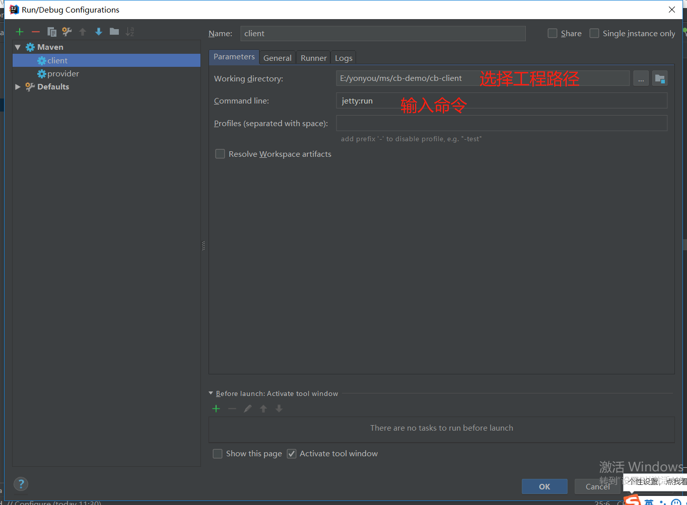
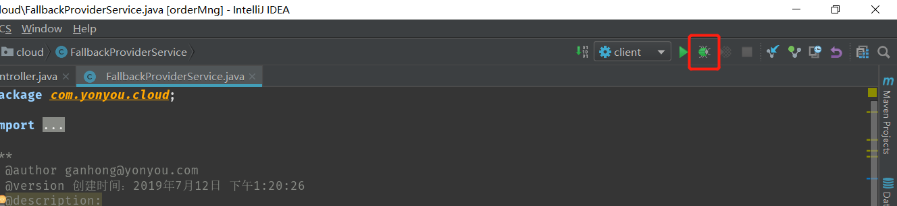
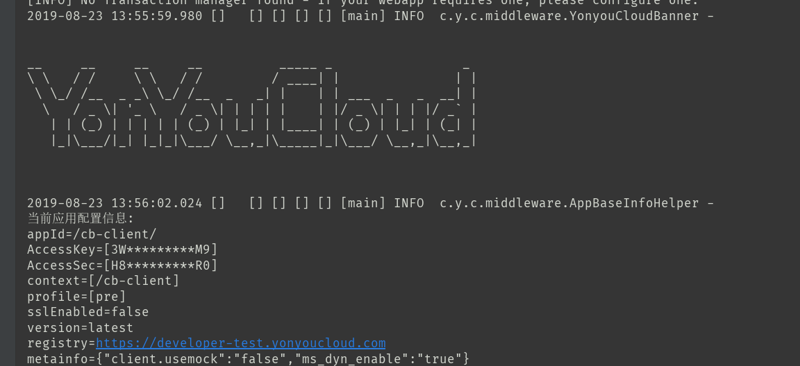
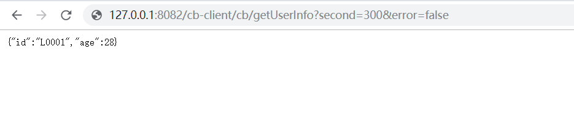
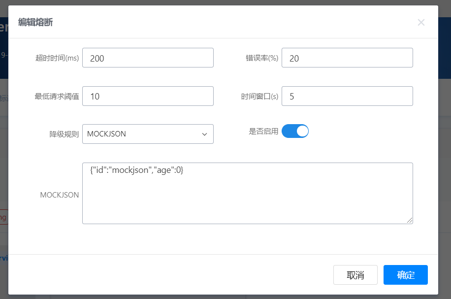
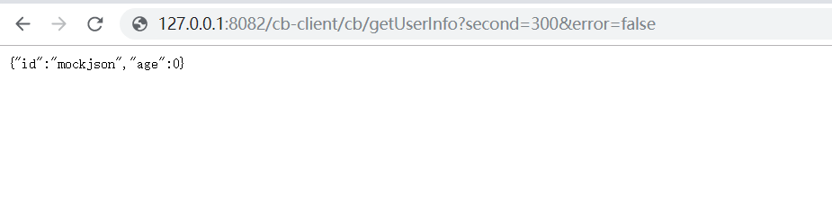

# 示例配置与运行

导入到IDE后，开发者需要将申请的AccessKey和秘钥添加到配置文件中，检查属性配置文件application.properties,调整工程编码等后，使用jetty的方式或者打成war包运行。

## 工程配置

cb-provider属性文件配置application.properties示例：

	access.key=申请的AK
	access.secret=AK对应的秘钥值

  #工程编码，同一租户内不能重复
	spring.application.name=cb-provider
	spring.profiles.active=online

## 工程运行

使用mvn clean install命令构建cb-demo工程，cb-pubapi工程会输出接口所在的jar包。

在IDE中，可以直接使用jetty:run的方式运行cb-client和cb-provider。jetty配置方式如下：

调试方式如下：

点击Debug按钮调试运行工程，控制台会打印启动日志如下：

控制台输出YonYouCloud的信息，工程启动成功，同理可启动cb-client工程。

工程启动成功后，可以在浏览器中输入地址进行RPC调用测试，例如：

示例中的数据是cb-client通过RPC的方式方位远程服务获取的。

通过在控制台设置熔断规则，将超时时间设置为200ms：

则以300ms运行demo将会触发熔断：

返回值即为MOCKJSON中配置的对象。
