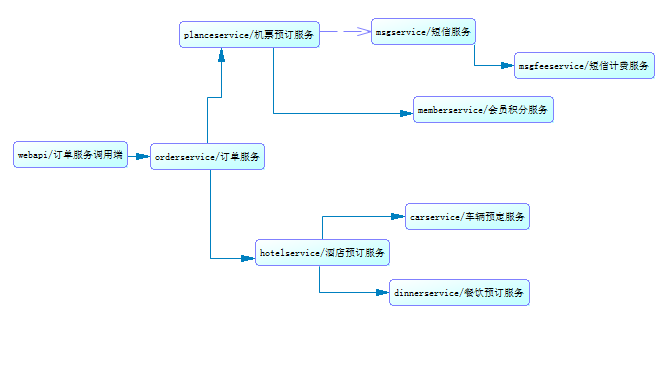
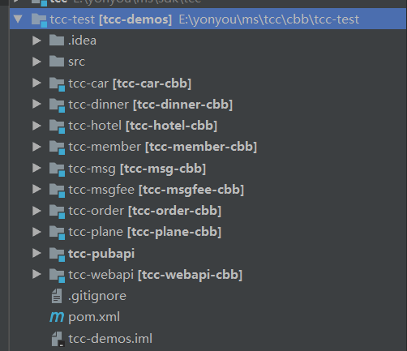

# 示例介绍

微服务治理平台提供针对5.2.1-RELEASE的官方完整TCC示例工程，工程采用Maven构建，包含父工程（tcc-test）、公用API工程（tcc-pubapi）、9个服务工程。服务工程的调用关系如下（实线箭头为RPC调用，虚线箭头为异步调用）：

业务开发者可以将示例以已有Maven工程的方式导入到IDE中进行运行调试，导入到IDE中后，效果如下：

## tcc-test

tcc-test为几个示例工程的父工程，为pom类型，工程中规范了各个子工程引用的组件的版本，定义了各个maven插件的使用方式，以及部署仓库地址。

工程包含10个maven子工程，模块列表如下：

		<modules>
				<module>tcc-pubapi</module>
				<module>tcc-webapi</module>
				<module>tcc-order</module>
				<module>tcc-plane</module>
				<module>tcc-member</module>
				<module>tcc-msg</module>
				<module>tcc-msgfee</module>
				<module>tcc-hotel</module>
				<module>tcc-car</module>
				<module>tcc-dinner</module>
		</modules>

用户可以使用tcc-test工程对几个示例工程进行统一的编译和打包。

## tcc-pubapi

tcc-pubapi工程为其它9个工程的公共依赖，工程内定义了RPC同步调用和EOS异步调用中使用的接口，RemoteCall注解会标记在各个接口上。示例中使用到的接口列表如下：

- IOrderService ： 订单服务接口，RPC同步调用；
- IMsPlaneService ： 机票预订服务接口，RPC同步调用；
- IMsMsgService ： 短信服务接口，异步调用
- IMsMsgFeeService ： 短信计费服务接口，PRC同步调用；
- IMsMemberService ： 会员积分服务接口，PRC同步调用；
- IMsHotelService ： 酒店预订服务接口，PRC同步调用；
- IMsCarService ： 车辆预订服务接口，PRC同步调用；
- IMsDinnerService ： 餐饮预订服务接口，PRC同步调用；

各个接口的实现分布在8个不同的服务提供者工程中，接口中使用到了注解，注解示例如下：

	//注解中value的格式为appcode@providerid
	@RemoteCall(“tcc-order@租户id”)

业务方法需要加上@TccTransactional注解，以标识该业务方法对应的事务提交和回滚方法：

		@TccTransactional(confirm="confirmOrder", cancel="cancelOrder")
	  public abstract TourOrder order(TourOrder paramTourOrder);

在同一接口中定义对应的事务提交和回滚方法，提交和回滚方法需要@Async注解：

	  @Async
	  public abstract TourOrder confirmOrder(TccTransactionContext context, TourOrder paramTourOrder);

	  @Async
	  public abstract TourOrder cancelOrder(TccTransactionContext context, TourOrder paramTourOrder);

异步业务方法同时需要@Async注解：
		@TccTransactional(confirm="confirmMsg", cancel="cancelMsg")
		@Async
		public abstract void sendMsg(String phone, String msg, String bizId,String userid);

开发者在本地IDE中开发调试过程中，可以将此工程在本地install之后再调试其他工程。

## tcc-webapi

tcc-webapi工程为微服务的调用方示例，示例中引入了SpringMVC框架，开发者可以在运行起几个示例工程之后，使用浏览器或者PostMan工具访问RestFul服务进行测试。例如，简单RPC调用的测试访问地址为：

	http://localhost:8080/tcc-webapi

tcc-webapi工程的本地服务中，使用spring的方式依赖了远程服务的接口，依赖的示例代码如下：

@Autowired
private IOrderService orderService;

客户端可以像调用本地服务一样调用上述远程服务。

## 提供端服务

本demo有8个提供端服务，以tcc-order为例。tcc-order为RPC的服务提供者示例，是IOrderService接口的具体实现类所在的工程，提供远程接口的业务实现，工程引用了微服务治理平台提供的SDK，在服务的启动过程中，会将远程接口的元数据信息上报到后端，在统一的管理面板上可以看到接口的API信息。

在此工程中需要依赖tcc和eos-spring-support。版本信息如下：

		<tcc.version>5.2.1-RELEASE</tcc.version>
		<eos-spring-support.version>5.2.1-RELEASE</eos-spring-support.version>

依赖信息如下：

		<dependency>
			<groupId>com.yonyou.cloud.middleware</groupId>
			<artifactId>tcc</artifactId>
			<version>${tcc.version}</version>
		</dependency>

		<dependency>
			<groupId>com.yonyou.cloud.middleware</groupId>
			<artifactId>eos-spring-support</artifactId>
			<version>${eos-spring-support.version}</version>
		</dependency>

此Maven工程的结构如下图所示：

同时需要在application.xml中配置eos和tcc：

		<bean id="eosConfig" class="com.yonyou.cloud.config.eos.EosConfig">
			<property name="jdbcTemplate" ref="jdbcTemplate" />
			<property name="transactionManager" ref="transactionManager" />
			<property name="authSDKClient" ref="authSDKClient" />
			<property name="fullScanIntevalSend" value="0" />
			<property name="fullScanIntevalActionLog" value="0" />
			<property name="batchSendMQCount" value="500"/>
			<!-- eos发送异常时重试间隔，个数与maxSendTryErrCount一致,测试重试，重试间隔设置小一点	-->
			<property name="maxSendTryErrCount" value="4"/>
			<property name="maxSendTryGap">
				<list>
					<value>1000</value>
					<value>2000</value>
					<value>3000</value>
					<value>4000</value>
					<value>5000</value>
				</list>
			</property>
			<!-- eos接收异常时重试间隔，个数与maxRecvTryErrCount一致 	-->
			<property name="maxRecvTryErrCount" value="4"/>
			<property name="maxRecvTryGap">
				<list>
					<value>5000</value>
					<value>7000</value>
					<value>9000</value>
					<value>11000</value>
					<value>13000</value>
				</list>
			</property>
			 <property name="eosCenterUrl" value="${eos.cloud.url}"/>
		</bean>

		<bean id="tccMonitorConfig"
			class="com.yonyou.cloud.config.TccMonitorConfig">
			<property name="jdbcTemplate" ref="jdbcTemplate2" />
			<property name="tccMonitorUrl" value="${tcc.cloud.url}"/>
		</bean>

${eos.cloud.url}和${tcc.cloud.url}可在application.properties文件中配置：

		tcc.cloud.url=https://developer-test.yonyoucloud.com/eos-console/
		eos.cloud.url=https://developer-test.yonyoucloud.com/eos-console/
