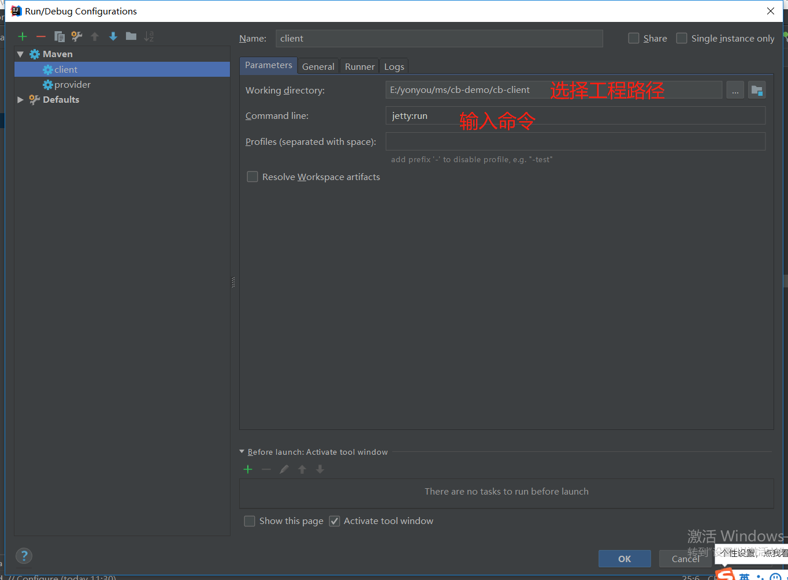
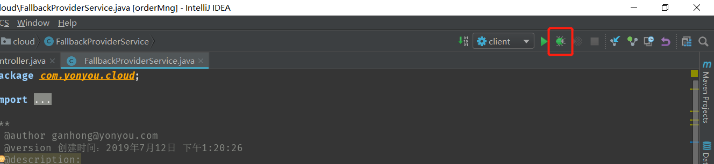
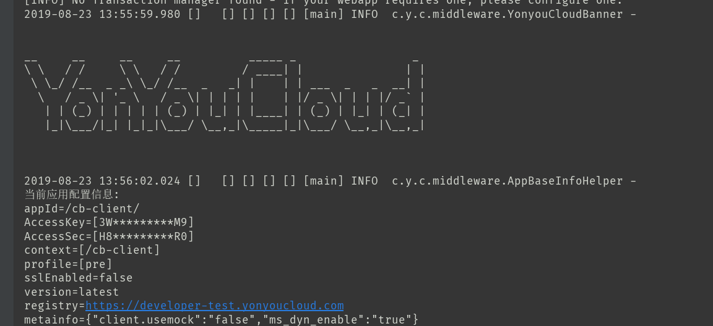
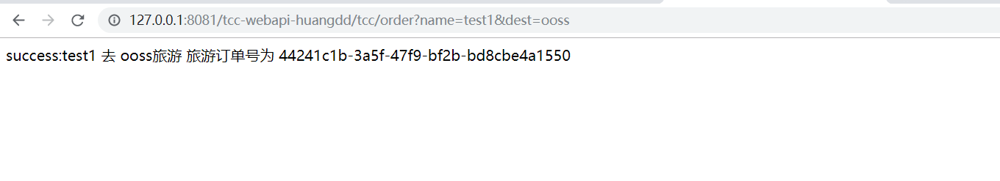
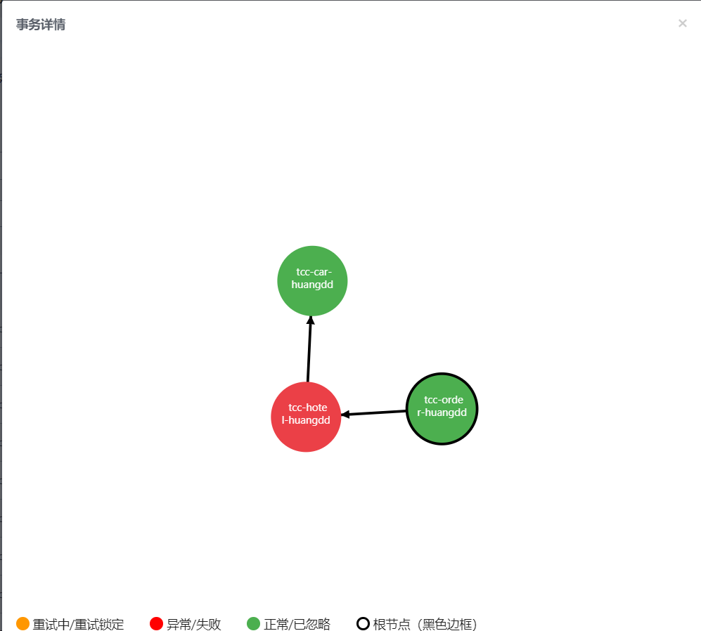
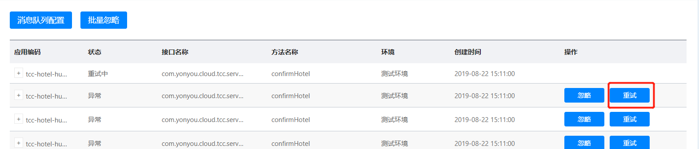

# 示例配置与运行

导入到IDE后，开发者需要将申请的AccessKey和秘钥添加到配置文件中，检查属性配置文件application.properties,调整工程编码等后，使用jetty的方式或者打成war包运行。

## 工程配置

tcc-order属性文件配置application.properties示例：

		access.key=申请的AK
		access.secret=AK对应的秘钥值

    #工程编码，同一租户内不能重复
		spring.application.name=tcc-order
		spring.profiles.active=online

		#若不配置，则为公有云地址
		tcc.cloud.url=https://developer-test.yonyoucloud.com/eos-console/
		eos.cloud.url=https://developer-test.yonyoucloud.com/eos-console/

## 工程运行

使用mvn clean install命令构建tcc-test工程，tcc-pubapi工程会输出接口所在的jar包。

在IDE中，可以直接使用jetty:run的方式运行tcc-webapi和其它服务工程。jetty配置方式如下：

调试方式如下：

点击Debug按钮调试运行工程，控制台会打印启动日志如下：

控制台输出YonYouCloud的信息，工程启动成功。

工程启动成功后，可以在浏览器中输入地址进行RPC调用测试，例如：

事务提交或回滚失败时，可在控制台中查看可靠消息和事务，修复异常后，可在可靠消息中手动重试：

