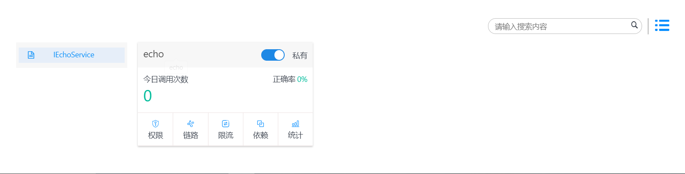
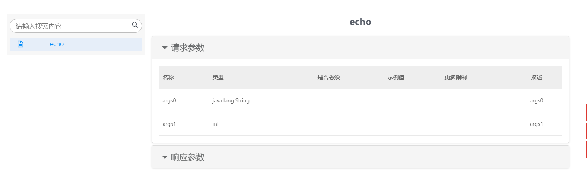

# 服务描述信息

### 功能简介

服务描述信息是在微服务展示面板上，展示服务基本信息：是否私有、今日调用次数、调用成功率。并且提供权限、链路、限流、依赖、统计等功能的入口。

进入微服务接口详情，展示接口请求参数，请求接口参数的名称、类型、是否必须、示例值、更多限制、描述等信息。接口响应的参数，响应接口参数的名称、类型、示例值、描述等信息。

服务描述信息的意义在于方便使用者快速查看服务的接口详情，接口对应的参数详情。

### 主要特征

- 展示服务提供接口的调用信息。
- 展示服务接口的参数信息。

### 接入步骤
