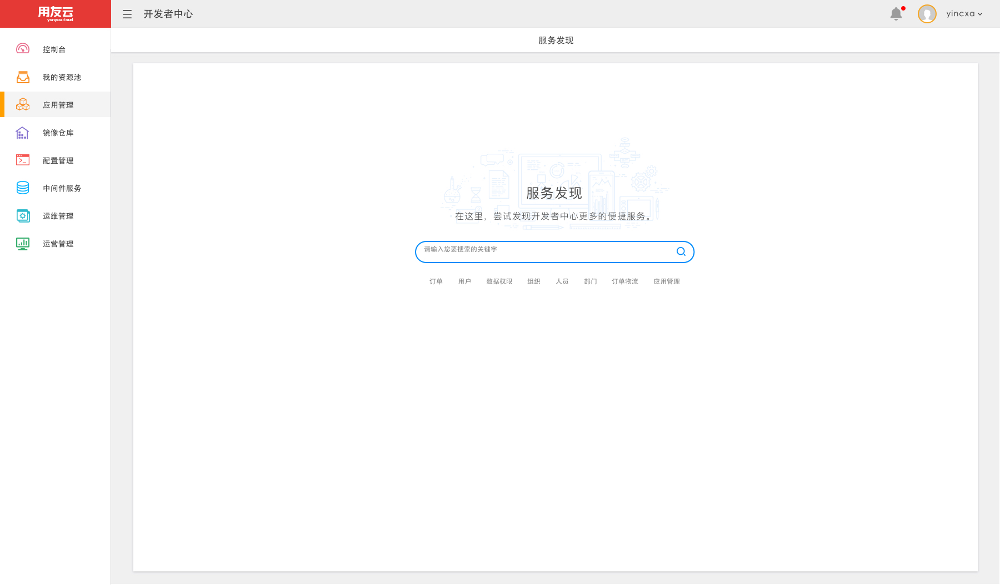
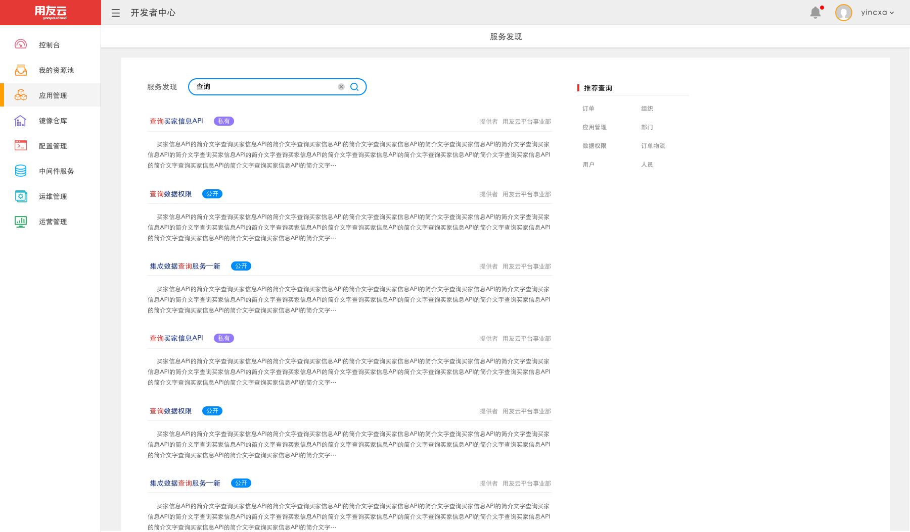
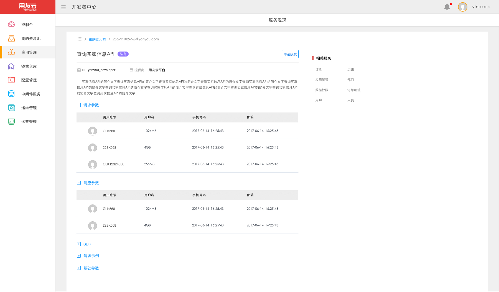

# 服务搜索

控制台的服务搜索模块可以对注册到用友云微服务注册中心的服务进行检索，支持对服务进行关键字和名称的模糊搜索，以及搜索结果进行具体详情的展示，包含服务的提供商，服务的请求参数，响应参数等。

支持微服务下所有微服务的检索，如图

展示检索到的服务列表 ，如图

选择某个服务的具体详情展示 ，如图

根据

- 用户搜索调用后端的接口，进行微服务服务列表的展示
- 用户选择某一项服务，进行当前服务的详情展示

## 主要特征
- 进行微服务下，服务列表的展示
- 对选择的某个服务，进行详情信息的展示
