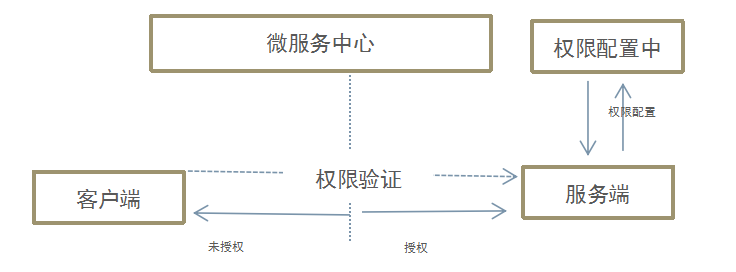
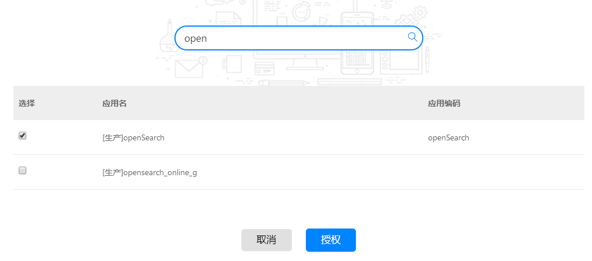

## 权限控制 
对提供的微服务进行安全控制，

服务接口权限分为公有接口、私有接口。公共状态下所有注册开发者中心的消费者都可以调用。
私有状态下需要通过授权操作，对消费者应用进行授权，只有进过授权的消费者才可以调用。

权限调用流程示意

授权操作步骤：
- 搜索相同环境下的消费者
- 授权
- 展示已授权列表

如图：

## 主要特征

- 配置中心统一管理权限
- 公有接口无需控制
- 私有接口需授权访问
- 公有私有相互转换
