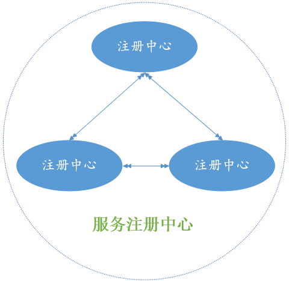

# 服务注册中心

## 功能简介

用友云服务注册中心是微服务核心模块之一, 是基于REST的云端服务注册/发现和故障转移的中间件服务, 对整个微服务架构起着最核心的整合作用.

## 主要特征

- 服务注册: 服务客户端启动时检测自己的元数据(如:主机和端口等信息)上报且注册到注册中心. 服务注册中心通过接收此服务的各个实例的心跳信息来检查服务客户端的健康状态.

- 服务发现: 发起远程调用时, 会注册中心拉取被调用服务的信息(如服务有多少实例,每个实例的IP/域名和端口是什么)并且缓存到本地, 方便使用负载均衡的方式去调用远程服务; 被缓存的远程服务信息会被定时从注册中心拉取刷新, 以便发现新的服务实例和删除有异常的服务实例.

- 高可用&快速恢复: 服务注册中心使用集群方式搭建, 防止单点故障, 在客户端和注册中心交互时会绕过集群中有异常的节点访问正常的节点. 集群异常节点恢复后会从集群中的其他节点拉取客户端注册的信息并且加入集群中对外正常提供服务.

- 网络多跃点智能检测: 在复杂网络下的服务可能会有多个IP和端口, 在客户端注册服务到注册中心时, 会上报所有网络设备点的IP/域名和端口; 在远程调用时, 会智能检测跃点数最少的可联通的地址. 以保证远程调用时跃点的数量、路径的速度, 提高服务的可靠性和吞吐量. 

## 接入步骤

使用&接入说明: 支持Maven工程:

1. 在pom.xml中引入下列依赖:<pre>
&lt;groupId&gt;com.yonyou.cloud.middleware&lt;/groupId&gt;
		&lt;artifactId&gt;mwclient&lt;/artifactId&gt;
		&lt;version&gt;2.1.1-SNAPSHOT&lt;/version&gt;
&lt;/dependency&gt;
</pre>

2. 在src/main/resources源文件夹下新建文件application.properties, 其内容如下:</pre> 
!应用名称 
spring.application.name=ms-server 
!应用部署端口 
server.port=20060 
!应用部署的环境,支持:dev(开发),test(测试),online(线上) 
spring.profiles.active=online 
!租户的秘钥Key 
access.key=7w216CPMgbdNVkar 
!租户的秘钥值 
access.secret=Y9p69q7FhPRNBNmyLdv9XrUNOxtwnP</pre>

3. 将web.xml中配置的SpringListener**替换**为MwClientListener:<pre>
&lt;listener&gt;
		&lt;listener-class&gt;org.springframework.web.context.ContextLoaderListener&lt;/listener-class&gt;
&lt;/listener&gt;
</pre>
4. 注意application.properties文件中的server.port要和实际web容器的对外暴露的服务端口一致.

